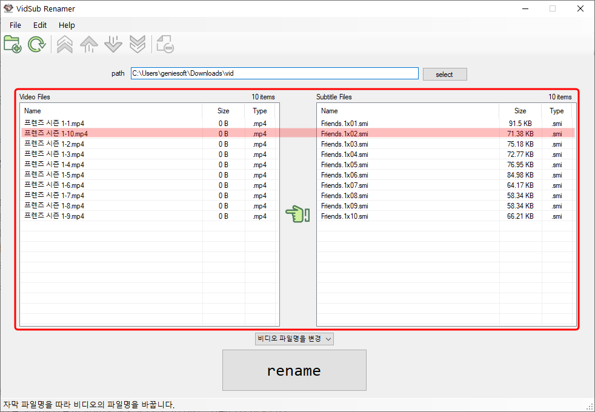

# VidSub Renamer

  
Rename video or subtitle file name easily!  
VidSub Renamer는 자막 파일명을 비디오 파일명에 맞게 또는 비디오 파일명을 자막 파일명에 맞추어 일괄적으로 변경해주는 프로그램입니다.  

## Features

- Easily rename video or subtitle files.
- Choose rename target files(video or subtitle)
- Preview before rename files

## Download

Download latest version from [Releases page](https://github.com/uiyoung/VidSub-Renamer/releases)

## How to use

1. 폴더 열기(`ctrl+O`)

   - 폴더선택 버튼 또는 select 버튼을 눌러 비디오 파일과 자막이 있는 폴더를 선택합니다.(`ctrl+O`)
     

2. 목록 확인하기

   - 폴더에서 불러온 비디오파일과 자막파일의 목록을 확인합니다.
     
   - 왼쪽에는 비디오파일을, 오른쪽에는 비디오파일을 리스트로 보여줍니다.
   - 현재 두번째 비디오파일 때문에 자막파일 순서와 맞지 않은 것을 확인합니다.

3. 목록 수정하기

   - 좌우 리스트의 순서에 맞게 파일명이 변경되므로 비디오와 자막 파일의 리스트를 순서대로 맞춥니다.
     
     

   - 목록의 순서를 바꾸고 싶은 경우에는 이동하고자 하는 아이템을 선택 후 이동버튼(맨위로, 위로, 아래로, 맨아래로)을 이용하여 이동시킵니다.
   - 필요없는 파일을 목록에서 제거하고 싶은 경우에는 제거할 아이템을 선택 후 제거버튼을 누릅니다.(목록에서 삭제해도 드라이브에서는 삭제되지 않습니다.)
   - 칼럼헤더를 클릭하면 파일명으로 오름차순, 내림차순 정렬을 할 수 있습니다.

4. 파일명 바꿀 타깃 선택하기

   - 손가락버튼 클릭 또는 콤보박스를 선택하여 자막파일명을 바꿀지 비디오파일명을 바꿀지 선택합니다.
     

5. 실행, 미리보기

   - rename 버튼을 눌러 실행합니다.
     
   - rename 버튼을 눌러 미리보기창에서 원본 파일명과 바뀔 파일명을 그리고 예상 결과를 확인합니다.
     

   _비디오 목록과 자막목록의 아이템 개수가 다른 경우에는 진행되지 않습니다._  
    _비디오 파일명을 바꾸는 경우 자막목록에 같은 이름의 파일이 있으면 진행되지 않습니다._  
    _자막 파일명을 바꾸는 경우 비디오목록에 같은 이름의 파일이 있으면 진행되지 않습니다._

6. 이름 바꾸기

   - 확인 버튼을 눌러 이름을 바꿉니다.

7. 결과 확인

   

## Known Issues

- UI shrinks when open folder in High resolution environment.

## Requirements

- .NET Framework 3.5 and above.

## Copyright Information

- Icons made by [Freepik](http://www.freepik.com/) from www.flaticon.com
